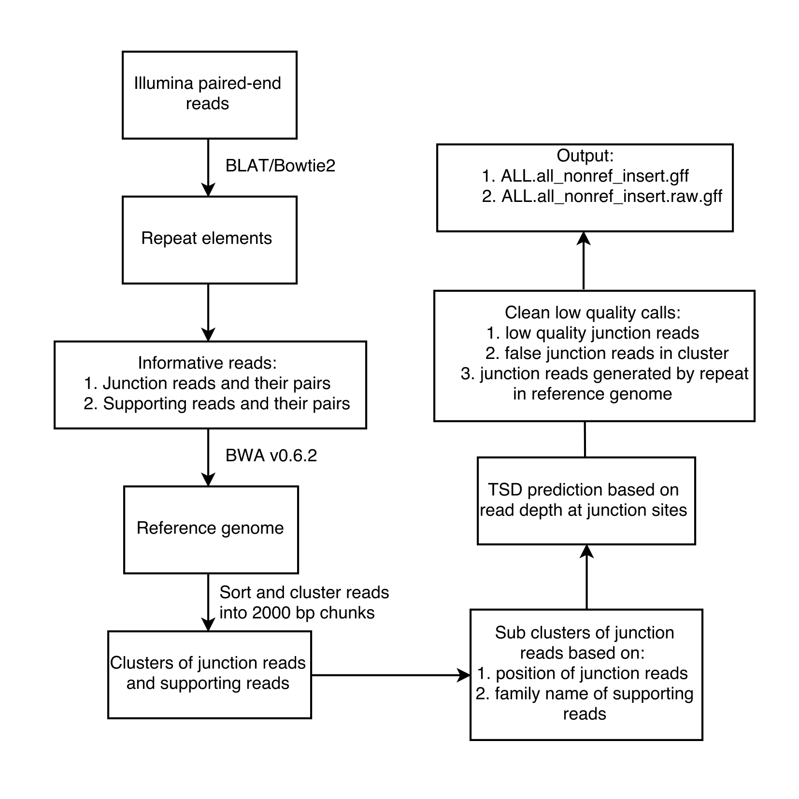

# RelocaTE2: a high resolution transposable element polymorphism mapping tool for 1population resequencing

## Introduction
RelocaTE2 is an improved version of RelocaTE ([Robb et al., 2013](http://www.g3journal.org/content/3/6/949.long)). RelocaTE2 is highly sensitive and accurate in mapping transposable elements (TE) polymorphisms at single base pair resolution. RelocaTE2 uses the reads associated with TEs as seeds to cluster the read pairs on chromosomes. It automatically detects the target site duplication (TSD) of a TE insertion from alignments in each cluster, which enable high resolution mapping of TE polymorphisms. Unlike parallel searching of multi-TE elements in RelocaTE, RelocaTE2 searches all TEs in one cycle, which enables us find polymorphisms of thousands of TEs in an individual genome or large population in a reasonable timeframe without losing sensitivity and specificity.



## Installation
+ System requirements
  - Linux/Unix platform
  - Short read aligner: BLAT (v35+), bowtie2 (v2.2.6+), bwa (v0.6.2)
  - Python (v2.7.5+) and pysam package (v0.8.5+)
  - Perl (v5.20.2+)
  - seqtk (v1.0+)

+ Install
```shell
git clone https://github.com/JinfengChen/RelocaTE2.git
cd RelocaTE2
bash install.sh
uz test_data.tar.gz
cd test_data
bash run_test.sh > run_test.sh.log 2>&1 &
```

+ Troubleshooting
  - Installation of RelocaTE2 using install.sh will install all the tools and packages required to run RelocaTE2. The script will install and link the executables of all tools to the RelocaTE2/bin directory and record their paths in RelocaTE2/CONFIG. The main script of RelocaTE2, relocaTE2.py, searches for executables in $PATH; however, the executables from RelocaTE2/CONFIG will supercede $PATH. Users can modify RelocaTE2/CONFIG with paths to tools installed on their specific system to avoid problems. 
  - The Python module "pysam" is installed to RelocaTE2/pythonlib. By setting PYTHONPATH=PATH\_OF\_RelocaTE2/pythonlib/lib64/python2.7/site-packages, any other locally-installed versions of pysam are temporarily ignored and the supported version of pysam for RelocaTE2 is used instead.
  - In RelocaTE2, we align trimmed reads to reference genome by bwa v0.6.2, which allows paired-end reads have different names in fastq files. We recommend using install.sh provided in RelocaTE2 to install these dependent tools including bwa v0.6.2.

## Quick Start Quide
  - Download [test_data.tar.gz](http://de.iplantcollaborative.org/dl/d/8A553ABA-14F3-44F2-A4D4-7D69C8AE8D89/test_data.tar.gz) if the file is not in RelocaTE2

  - set environment variables  
```shell
cd test_data
export PYTHONPATH=`pwd`/pythonlib/lib64/python2.7/site-packages:$PYTHONPATH
export PATH=`pwd`/bin:$PATH 
```
  - index reference genome
```shell
#reference genome
ref=test_data/MSU7.Chr3.fa
bwa index $ref
```
  - index repeat sequence if using bowtie2 as search engine (default is to use BLAT as search engine)
```shell
#repeat elements
repeat=test_data/RiceTE.fa
bowtie2-build $repeat $repeat
```
  - run RelocaTE2 to find transposable element insertions
```shell
#repeatmasker results of TE annotation on reference genome
ref_te=test_data/MSU7.Chr3.fa.RepeatMasker.out
#directory where the input fastq format reads are located
fq_dir=test_data/MSU7.Chr3.ALL.rep1_reads_2X_100_500/
#output directory where RelocaTE2 write temperary and final output
outdir=test_data/MSU7.Chr3.ALL.rep1_reads_2X_100_500_RelocaTE2_outdir
python script/relocaTE2.py --te_fasta $repeat --genome_fasta $ref --fq_dir $fq_dir --outdir $outdir --reference_ins $ref_te
```
  - check results of TE insertions and compare with simulated TE insertions
```shell
wc -l test_data/MSU7.Chr3.ALL.rep1_reads_2X_100_500_RelocaTE2_outdir/repeat/results/ALL.all_nonref_insert.gff
167
bedtools window -w 10 -a test_data/MSU7.Chr3.ALL.rep1.gff -b test_data/MSU7.Chr3.ALL.rep1_reads_2X_100_500_RelocaTE2_outdir/repeat/results/ALL.all_nonref_insert.gff | wc -l
167
```

## RelocaTE2 Command Line Options

```shell
python scripts/relocaTE2.py --help
usage: relocaTE2.py [-h] [-b BAM] [-t TE_FASTA] [-d FQ_DIR] [-g GENOME_FASTA]
                   [-r REFERENCE_INS] [-o OUTDIR] [-s SIZE] [-c CPU]
                   [-1 MATE_1_ID] [-2 MATE_2_ID] [-u UNPAIRED_ID]
                   [--sample SAMPLE] [--aligner ALIGNER]
                   [--len_cut_match LEN_CUT_MATCH]
                   [--len_cut_trim LEN_CUT_TRIM] [--mismatch MISMATCH]
                   [--mismatch_junction MISMATCH_JUNCTION] [--step STEP]
                   [--run] [--split] [-v VERBOSE]

optional arguments:
  -h, --help            show this help message and exit
  -b BAM, --bam BAM     Name of BAM file of reads mapped reference genome
  -t TE_FASTA, --te_fasta TE_FASTA
                        Name of fasta sequence of repeat element
  -d FQ_DIR, --fq_dir FQ_DIR
                        Name of directory of input fastq sequence data
  -g GENOME_FASTA, --genome_fasta GENOME_FASTA
                        Name of fasta file of reference genome sequence
  -r REFERENCE_INS, --reference_ins REFERENCE_INS
                        Name of RepeatMasker TE annotation of reference genome
  -o OUTDIR, --outdir OUTDIR
                        Name of output directory where to put temperary and
                        final results
  -s SIZE, --size SIZE  Insert size of sequence library, default = 500
  -c CPU, --cpu CPU     Number of CPUs to use for multiplex, default = 1
  -1 MATE_1_ID, --mate_1_id MATE_1_ID
                        string define paired-end read1, default = "_1"
  -2 MATE_2_ID, --mate_2_id MATE_2_ID
                        string define paired-end read2, default = "_2"
  -u UNPAIRED_ID, --unpaired_id UNPAIRED_ID
                        string defining single-end reads, default = ".unPaired"
  --sample SAMPLE       string defining sample name which will present in output
                        GFF, default = "not_given"
  --aligner ALIGNER     aligner used to map reads to repeat elements,
                        default=blat
  --len_cut_match LEN_CUT_MATCH
                        length cutoff threshold for match between reads and
                        repeat elements. Large value will lead to less
                        sensitive but more accuracy, default = 10
  --len_cut_trim LEN_CUT_TRIM
                        length cutoff threshold for trimed reads after
                        trimming repeat sequence from reads. Large value will
                        lead to less sensitive but more accuracy, default = 10
  --mismatch MISMATCH   Number of mismatches allowed for matches between reads
                        and repeat elements, default = 2
  --mismatch_junction MISMATCH_JUNCTION
                        Number of mismatches allowed for matches between
                        junction reads and repeat elements, default = 2
  --step STEP           Number to control steps of pipeline, default =
                        "1234567"
  --dry_run             write shell scripts only while this script excute
  --run                 run while this script excute
  --split               split fastq into 1 million reads chunks to run blat/bwa jobs
  -v VERBOSE, --verbose VERBOSE
                        verbose grade to print out information in all scripts:
                        range from 0 to 4, default = 2
```

## RelocaTE2 input
+ Reference genome sequence (ref): multiple sequences of reference genome in fasta format
```shell
cat test_data/MSU7.Chr3.fa | head -n 25
>Chr3
#########Skip lines of NNNNNN in sequence#########
CCTAAACCCTAAACCCTAAACCCTAAACCCTAAACCCTAAACCCTAAACC
CTAAACCCTAAACCCTAAACCCTAAACCCTAAACCCTAAACCCTAAACCC
TAAACCCTAAACCCTAAACCCTAAACCCTCAATCCTAACCCCTCAATCCT
AAGCCGTCTGCAGTGGCCATCGCAGGGTGAGGTGGGTGGAGGGTGAGTGA
```
+ Repeat sequence (repeat): Consensus sequences of repeat families in fasta format
```shell
cat test_data/RiceTE.fa | head -n 4
>mPing
GGCCAGTCACAATGGGGGTTTCACTGGTGTGTCATGCACATTTAATAGGGGTAAGACTGAATAAAAAATG
ATTATTTGCATGAAATGGGGATGAGAGAGAAGGAAAGAGTTTCATCCTGGTGAAACTCGTCAGCGTCGTT
TCCAAGTCCTCGGTAACAGAGTGAAACCCCCGTTGAGGCCGATTCGTTTCATTCACCGGATCTCTTGCGT
```
+ Resequencing data (fq_dir): Illumina reads from one strain in fastq format (fastq or fastq.gz). Sequences need to be put in one directory. Paired-end reads need to end with \_1.fastq and \_2.fastq.
```shell
ls test_data/MSU7.Chr3.ALL.rep1_reads_2X_100_500/*.fq
test_data/MSU7.Chr3.ALL.rep1_reads_2X_100_500/MSU7.Chr3.ALL.rep1_reads_2X_100_500_1.fq
test_data/MSU7.Chr3.ALL.rep1_reads_2X_100_500/MSU7.Chr3.ALL.rep1_reads_2X_100_500_2.fq

cat test_data/MSU7.Chr3.ALL.rep1_reads_2X_100_500/MSU7.Chr3.ALL.rep1_reads_2X_100_500_1.fq | head -n 4
@read_500_1/1
TGTAAGAGTGCTATTGATGTTCGTTAATATTGTGCTCATATTTATAACATAATGATTTCTTTCATCTATACGAACAAATAGTACAAAATCCAAATACGAC
+
GGGGGGFCCFGHEEE:?<8;C:;@<6=@BFGHEEHHHGGEBEEEEFFH?F;<<@HHFECFFHHHGFFFHHHFBE<BCDCDFHFHHHHHGBHHEED3;DHH

cat test_data/MSU7.Chr3.ALL.rep1_reads_2X_100_500/MSU7.Chr3.ALL.rep1_reads_2X_100_500_2.fq | head -n 4
@read_500_1/2
ATTAATAATTTAAAATCTATATTAACTAATGTACACTTACACTAGAACCGGTGGACCCATTATTTAAATCATCTGATATATTATTTGCTAATAAATAAAG
+
GGGFHHHHHHHGGGHHHHHHHEHFFEHFHHGHHHDHHHGHFFGEHHFHHHFGDC@=@GFGB4DEHHHECE>>8/@ABHHH?DGHBEFEDAEDHFBDBCC>
```
+ RepeatMasker results of TE annotation on reference genome (ref_te): default TE annotation of reference genome used to call TE insertions in reference genome and remove possible false positive non-reference TE insertions.
```shell
cat test_data/MSU7.Chr3.fa.RepeatMasker.out | head -n 4
  249   23.8  0.0  4.8  Chr3          1283     1366 (36412453) + CACTA-K             DNA/En-Spm             663    742   (389)     1  
 2250   19.7  0.7  0.9  Chr3          1973     2424 (36411395) + SZ-7_LTR            LTR/Gypsy                1    451   (131)     2  
 4798   12.5  5.6  1.0  Chr3          2425     3618 (36410201) + SZ_LTR              LTR/Gypsy                1   1249     (0)     3  
  820   15.4  0.0  0.0  Chr3          3619     3754 (36410065) + SZ-33_LTR           LTR/Gypsy              440    575     (0)     4
```
+ Bam file of reads mapping results on reference genome (bam): characterize heterozygous and homozygous TE insertions when BAM file is provided.

## RelocaTE2 output
+ Structure of output directory
  - blat\_output: BLAT results of reads to repeat sequence
  - bwa\_aln: bwa results of trimmed-reads to reference genome
  - flanking\_seq: trimmed-reads and their pairs
  - results: final results of TE insertions
  - te\_containing\_fq: temporary results of reads that matched to repeat sequence
  - te\_only\_read\_portions\_fa: temporary results of the proportion of reads that matched to repeat sequence

+ TE insertions
  - TE insertions shared between resequenced strain and reference genome: test\_data/MSU7.Chr3.ALL.rep1\_reads\_2X\_100\_500\_RelocaTE2\_outdir/repeat/results/ALL.all\_ref\_insert.gff
  - TE insertions only present in resequenced strain: test\_data/MSU7.Chr3.ALL.rep1\_reads\_2X\_100\_500\_RelocaTE2\_outdir/repeat/results/ALL.all\_nonref\_insert.gff
  - TE insertions characterized as heterozygous and homozygous as described in [Robb et al., 2013](http://www.g3journal.org/content/3/6/949.long): test\_data/MSU7.Chr3.ALL.rep1\_reads\_2X\_100\_500\_RelocaTE2\_outdir/repeat/results/ALL.all\_nonref\_insert.characTErized.gff.
+ GFF format used in RelocaTE2
```shell
cat test_data/MSU7.Chr3.ALL.rep1_reads_2X_100_500_RelocaTE2_outdir/repeat/results/ALL.all_nonref_insert.gff | head -n 4
Chr3	RelocaTE2	rice	85173	85180	.	-	.	ID=repeat_Chr3_85173_85180;Name=nDaiz;TSD=GTGCTTGT;Note=Non-reference, not found in reference;Right_junction_reads=1;Left_junction_reads=2;Right_support_reads=3;Left_support_reads=4;
Chr3	RelocaTE2	rice	239462	239464	.	+	.	ID=repeat_Chr3_239462_239464;Name=Truncator;TSD=supporting_junction;Note=Non-reference, not found in reference;Right_junction_reads=2;Left_junction_reads=0;Right_support_reads=4;Left_support_reads=2;
Chr3	RelocaTE2	rice	429710	429717	.	+	.	ID=repeat_Chr3_429710_429717;Name=nDaiz;TSD=CAAAATTT;Note=Non-reference, not found in reference;Right_junction_reads=2;Left_junction_reads=2;Right_support_reads=2;Left_support_reads=6;
Chr3	RelocaTE2	rice	522905	522907	.	+	.	ID=repeat_Chr3_522905_522907;Name=Dasheng;TSD=supporting_junction;Note=Non-reference, not found in reference;Right_junction_reads=0;Left_junction_reads=3;Right_support_reads=2;Left_support_reads=0;
```
Attributes in field 8 of GFF:

ID: unique id of TE insertions, repeat\_"chromosome"\_"start"\_"end"

Name: TE family name of this insertion

TSD: target site duplicate predicted from read alignments

Note: definition of TE insertions, including Non-reference, Reference-Only and Shared.

Right\_junction\_reads: number of reads covering the junction of TE insertion on right side/downstream.

Left\_junction\_reads: number of reads covering the junction of TE insertion on left side/upstream.

Right\_support\_reads: number of reads not covering the junction of TE insertion, but supporting TE insertion by paired-end reads on right side/downstream.

Left\_support\_reads: number of reads not covering the junction of TE insertion, but supporting TE insertion by paired-end reads on left side/downstream.

## Publications
1. [Robb S.M., Lu L., Valencia E., Burnette J.M. 3rd., Okumoto Y., Wessler S.R., Stajich J.E. The use of RelocaTE and unassembled short reads to produce high-resolution snapshots of transposable element generated diversity in rice. G3 2013;3:949-957.](http://www.g3journal.org/content/3/6/949.long)
